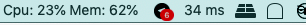

# CPU & Memory Monitoring tools Mac

The purpose of this tools is monitoring your CPU and Memory usage in your Mac OS <br /> 
This tools will appears in your system tray.

- Tested in Mac OS Mojave 10.14.6

### Screenshot



### How to build from source:

Requirements:
- Golang 1.13 or above
- Go module on

```cassandraql
$ git clone https://github.com/guaychou/cpu-memory-systray.git
$ cd cpu-memory-systray
$ chmod +x build.sh
$ ./build.sh
```
Download release [here](https://github.com/guaychou/cpu-memory-systray/releases/download/v1.0/CpuMemoryService.zip)

Credits to :

- [getlantern](https://github.com/getlantern/systray)
- [shirou](https://github.com/shirou/gopsutil)
